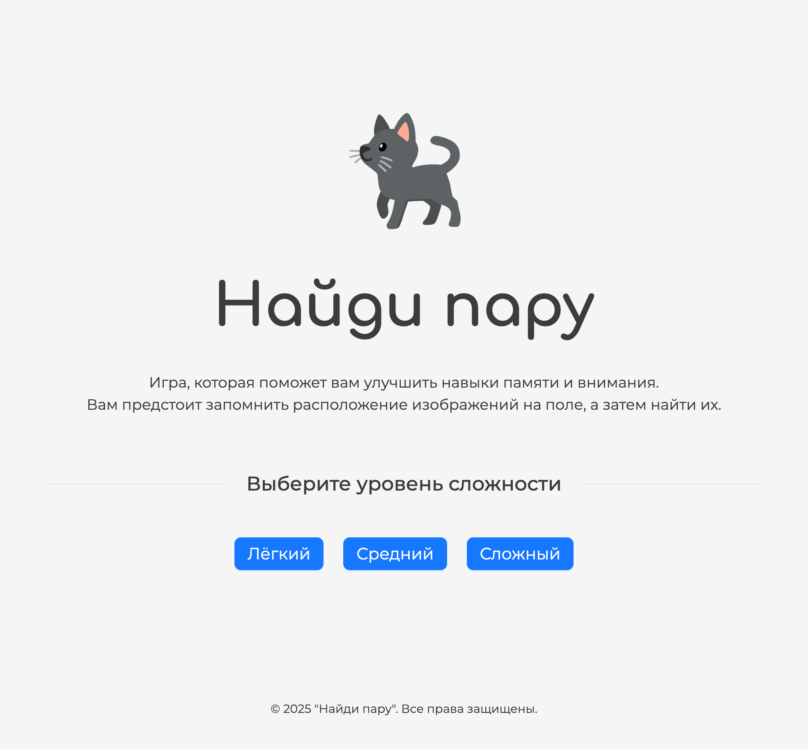

# Найди пару

## Описание
Игра "Найди пару" (также известная как "Мемори") - головоломка, предназначенная для развития памяти и внимания. 
Это одна из самых популярных игр для тренировки когнитивных способностей, которая подходит как детям, так и взрослым.

Написана с использованием React и библиотеки компонентов Ant Design.

## Как выглядит

## Особенности
- Три уровня сложности
- Картинки для поиска с котиками